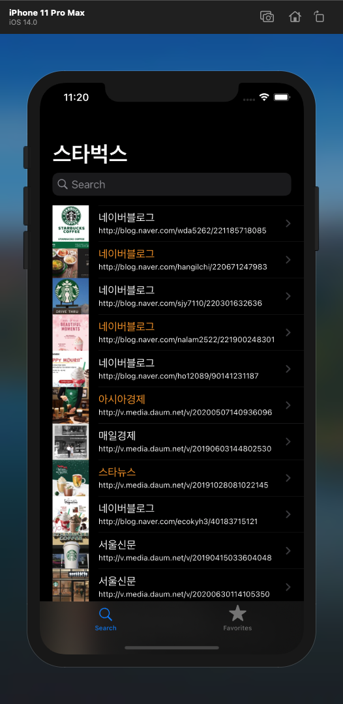
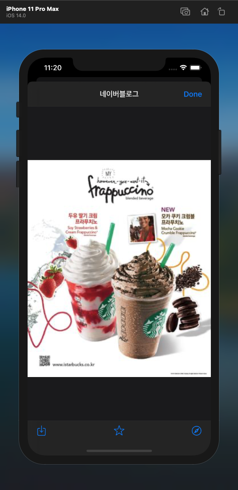
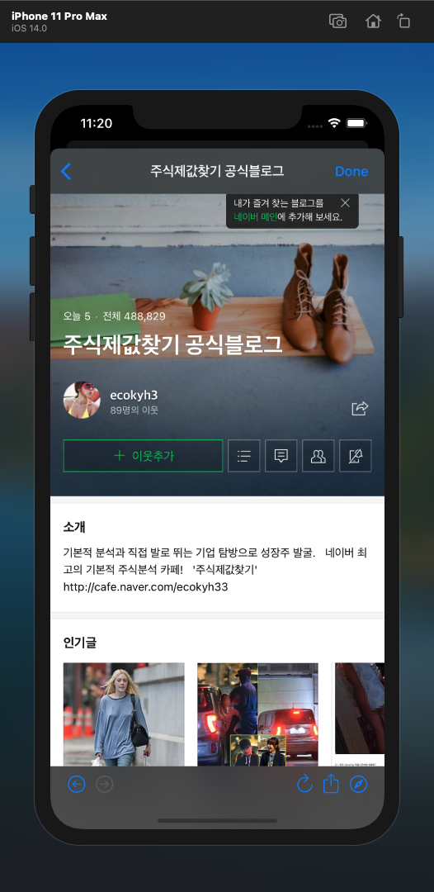
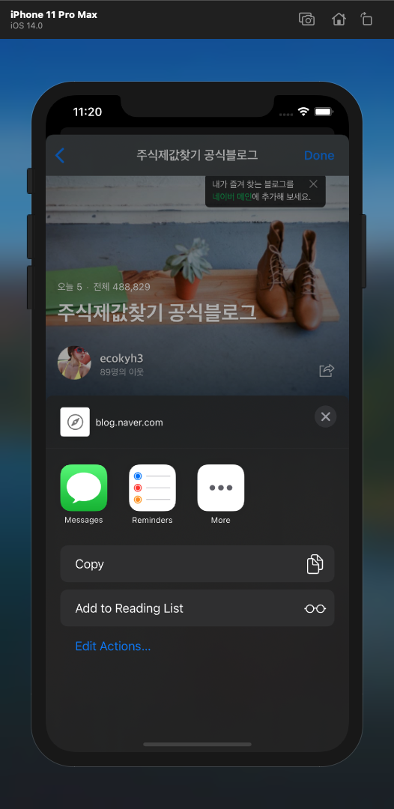
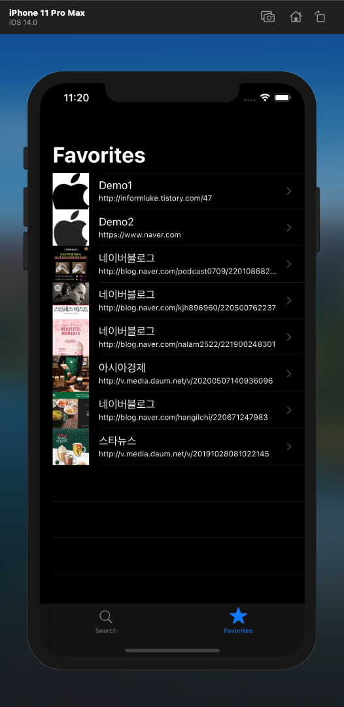

# ImageSearch-ObjC

[Daum 이미지 검색 REST API](https://developers.kakao.com/docs/latest/ko/daum-search/dev-guide)를 이용한 이미지 검색 어플입니다.

## 특징

- Objective-C로 작성

- MVVM 패턴

- 검색어를 입력하면 이미지 검색

- 사진 크게 보기

- 사이트 열기, 공유하기

- 즐겨찾기 지정하기

## 할 일

- 이미지 캐싱

- 사진 저장

- FavoritesViewController 부분만 UITableView 대신 UICollectionView를 써보기

## 다른 ImageSearch

- [ImageSearch-SwiftUI](https://github.com/pookjw/ImageSearch-SwiftUI) : Swift로 작성 및 SwiftUI, Combine 사용

- [ImageSearch-Swift](https://github.com/pookjw/ImageSearch-Swift) : Swift로 작성 및 UIKit, RxSwift, RealmSwift 사용

## 스크린샷

